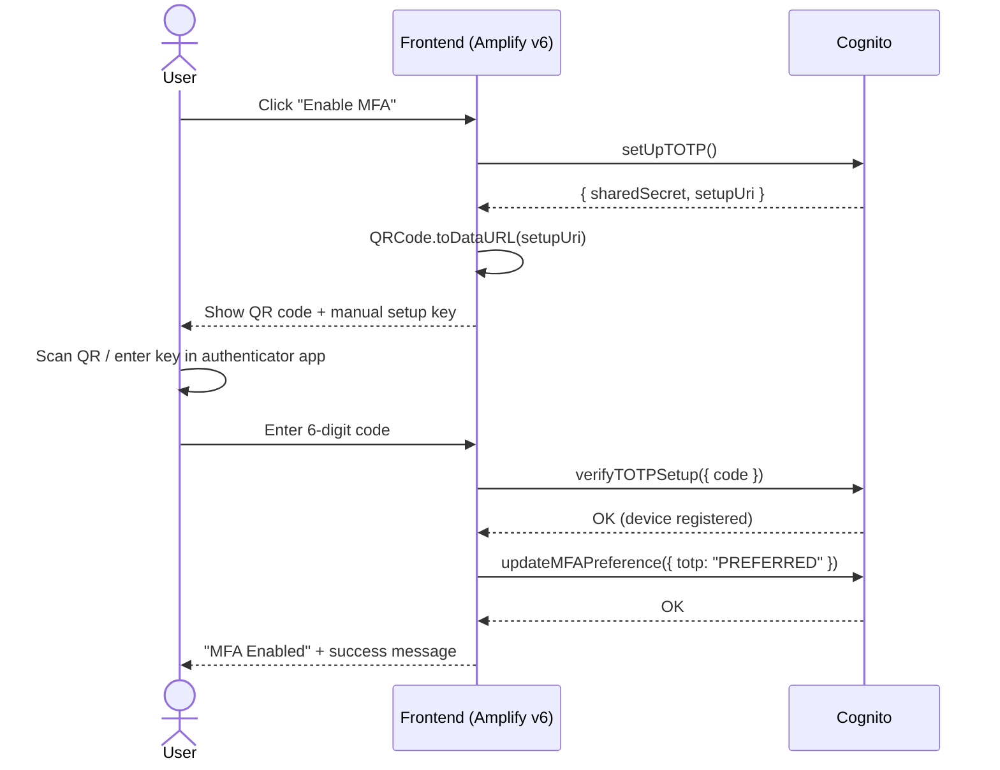
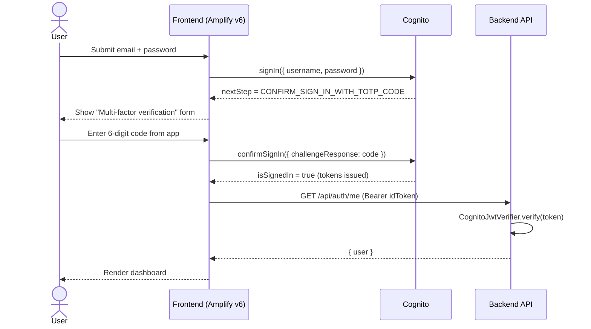
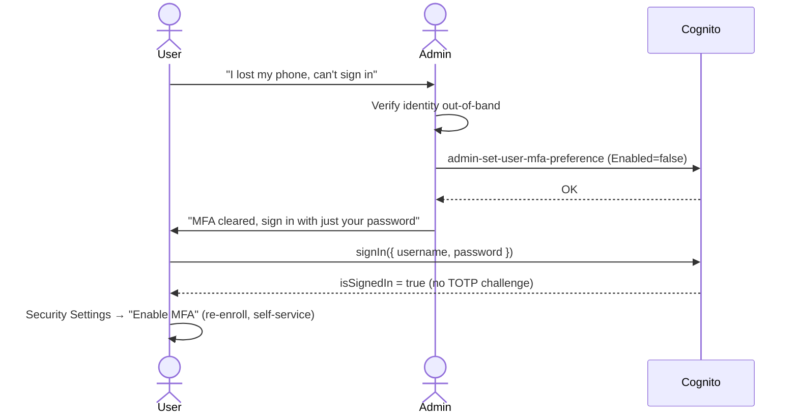

# Multi-Factor Authentication (TOTP)

Self-service TOTP (authenticator app) MFA enrollment and management, built entirely on
Cognito's own self-service APIs via AWS Amplify Auth v6. No admin APIs are used anywhere
in the enroll/verify/disable/reconfigure paths — every action is performed by the signed-in
user against their own account.

## Where the code lives

- [frontend/main.js](frontend/main.js) — Security Settings page (`renderSecuritySettingsMarkup`,
  `attachSecuritySettingsListeners`, `loadMfaStatus`, `handleStartMfaSetup`,
  `handleVerifyMfaSetup`, `handleDisableMfa`), plus the login-time TOTP setup challenge
  (`handleAuthNextStep`, `renderMfaStep`, `handleMfaSubmit`).
- [frontend/styles.css](frontend/styles.css) — `.mfa-status-badge`, `.qr-code-wrap`,
  `.authenticator-app-list`, `.success`.
- `backend/` — unchanged. No MFA logic exists or is needed there (see below).

## Why MFA stays entirely in Cognito + the frontend

The backend ([backend/middleware/auth.js](backend/middleware/auth.js)) only ever validates a
Cognito-issued ID token with `aws-jwt-verify` and reads its claims (`sub`, `email`). It has no
code path that touches MFA, and it should stay that way:

1. **Cognito is the source of truth for the credential.** The TOTP secret is generated,
   stored, and validated entirely inside Cognito's User Pool (`AssociateSoftwareToken` /
   `VerifySoftwareToken` / `RespondToAuthChallenge` under the hood). The backend never sees
   the secret, the QR code, or the 6-digit code — there is nothing for it to validate.
2. **The JWT is already the proof MFA happened.** Cognito does not issue tokens until every
   required challenge (password + TOTP, when enabled) is satisfied. By the time the backend
   sees a Bearer token, MFA enforcement already happened upstream. Re-implementing any part
   of that check in the backend would duplicate Cognito's job and create a second place that
   can drift out of sync with the real policy.
3. **Smaller attack surface.** A backend with no MFA logic cannot have a bug that lets MFA be
   bypassed, mis-enforced, or enabled for the wrong user. The only thing it can get wrong is
   JWT verification, which is a single well-tested library call.
4. **No admin credentials in the request path.** Self-service enroll/disable only ever needs
   the user's own session (`fetchAuthSession`). If the backend exposed `/api/mfa/*` endpoints,
   it would need either to proxy the user's own Cognito calls (no benefit over calling Cognito
   directly from the browser) or to use `Admin*` APIs with pool-wide credentials (which is the
   pattern the requirements explicitly rule out, for good reason: it would mean a backend bug
   or compromised backend credential could enable/disable MFA for any user in the pool).

The only place admin-level Cognito access is used at all in this repo is the **seed script**
([backend/db/seed.js](backend/db/seed.js)), which creates fixed demo users for local
development — and the **MFA recovery runbook** below, which is an out-of-band operational
procedure run by an administrator, not application code.

## Frontend self-service flow

All calls are from `aws-amplify/auth` (Amplify v6), operating on the current user's own
session:

| Action | API | Notes |
|---|---|---|
| Check current status | `fetchMFAPreference()` | Returns `{ enabled: ['TOTP'?], preferred }` |
| Start enrollment | `setUpTOTP()` | Returns `{ sharedSecret, getSetupUri(issuer, account) }` |
| Render QR | `QRCode.toDataURL(uri)` (`qrcode` npm package) | `uri` from `getSetupUri()` |
| Verify code, register device | `verifyTOTPSetup({ code })` | Throws `CodeMismatchException` / `ExpiredCodeException` on bad code |
| Mark TOTP as the user's MFA method | `updateMFAPreference({ totp: 'PREFERRED' })` | Required — `verifyTOTPSetup` alone registers the device but doesn't select it for sign-in |
| Disable | `updateMFAPreference({ totp: 'DISABLED' })` | |
| Reconfigure (new device) | `setUpTOTP()` again → new secret/QR → `verifyTOTPSetup` → `updateMFAPreference` | Re-running setup overwrites the previously registered (unverified-for-reuse) secret |

### Login-time states handled

`handleAuthNextStep` in [frontend/main.js](frontend/main.js) switches on Amplify's
`signIn`/`confirmSignIn` `nextStep.signInStep`:

- `CONTINUE_SIGN_IN_WITH_TOTP_SETUP` — Cognito is requiring TOTP setup before completing
  sign-in (e.g. an admin set `mfa_configuration = "ON"` for the pool, or per-user MFA was
  required by other means). Renders the same QR/secret/code UI as self-service enrollment.
- `CONFIRM_SIGN_IN_WITH_TOTP_CODE` — user already has TOTP enabled; prompts for the 6-digit
  code and calls `confirmSignIn({ challengeResponse: code })`.
- `DONE` — sign-in complete; loads the session and renders the dashboard.
- `CONFIRM_SIGN_UP` — unrelated to MFA, already handled for the existing passwordless/sign-up flow.
- Any other step throws a clear "Unsupported sign-in step" error rather than failing silently
  — the pool currently only issues these four, so this is a deliberate fail-fast for any future
  Cognito-side config change (e.g. enabling SMS MFA) that this UI doesn't yet support.

Errors from any Cognito call are passed through `authErrorMessage()`, which maps known
exception names (`CodeMismatchException`, `ExpiredCodeException`, `NotAuthorizedException`,
`LimitExceededException`, etc.) to plain-language messages, falling back to the raw error
message for anything unmapped.

## Recovery: user lost their authenticator app

Self-service MFA has no "self-service recovery" — that's by design (anyone who could
self-service-disable MFA without proving possession of the device would defeat the point of
MFA). Recovery requires an administrator, using Cognito's `Admin*` API **only for this
out-of-band recovery action**, never for the normal enroll/disable flow:

1. **Verify the user's identity** through an out-of-band channel (support ticket + identity
   checks appropriate to your risk tolerance — e.g. confirm account email ownership, billing
   details, etc.). This step is a process control, not a technical one; get it right.
2. **Clear the user's MFA registration:**
   ```bash
   aws cognito-idp admin-set-user-mfa-preference \
     --user-pool-id <POOL_ID> \
     --username <user-email-or-sub> \
     --software-token-mfa-settings Enabled=false,PreferredMfa=false
   ```
   This only removes the *registration*; it does not touch the user's password or any other
   attribute, and it does not require knowing the lost device's code.
3. **Tell the user to sign in normally.** Since MFA is now disabled for that account, they
   sign in with just their password and land on the dashboard with no TOTP challenge.
4. **User re-enrolls a new device** themselves from Security Settings → "Enable MFA", exactly
   like first-time setup. No admin involvement needed for this step — re-enrollment is
   self-service by design, same as initial enrollment.

If you want defense-in-depth here, restrict who can run `admin-set-user-mfa-preference` via an
IAM policy scoped to a small support/admin group, and log every invocation (CloudTrail already
captures Cognito Admin API calls).

### "Reconfigure" vs. recovery

If the user still has access to their account (i.e. they can sign in, just want to switch to a
new phone) they don't need recovery at all — Security Settings → "Reconfigure (new device)"
calls `setUpTOTP()` again and walks them through the same QR/verify flow, no admin step
required. The recovery runbook above is only for the case where they're locked out (can't
produce a valid code at all, e.g. lost/wiped phone).

## Cognito configuration checklist

- [x] `software_token_mfa_configuration { enabled = true }` on the User Pool
      ([terraform/cognito.tf](terraform/cognito.tf))
- [x] `mfa_configuration = "OPTIONAL"` (not `OFF`, not `ON`) — lets users opt in via
      self-service rather than forcing it pool-wide
- [x] User Pool Client has no `explicit_auth_flows` restriction that would block
      `SOFTWARE_TOKEN_MFA` challenge responses (default SRP + refresh-token flows are
      sufficient — `RespondToAuthChallenge` for `SOFTWARE_TOKEN_MFA` doesn't need a separate
      auth flow to be enabled)
- [x] `account_recovery_setting` has `verified_email` recovery configured — needed for the
      *password* reset flow, independent of MFA recovery (which is the admin runbook above,
      not Cognito's account-recovery mechanism)
- [ ] If you want stronger control over the manual admin-reset path, add a scoped IAM policy
      limiting which principals can call `cognito-idp:AdminSetUserMFAPreference`, and enable
      CloudTrail logging on the User Pool's region if not already on by default
- [ ] Decide whether `mfa_configuration` should move from `OPTIONAL` to `ON` once enough users
      have enrolled — `ON` would route every Cognito user through
      `CONTINUE_SIGN_IN_WITH_TOTP_SETUP` on next login if they haven't enrolled yet, which this
      app's login flow already handles (see above), but is a deliberate policy decision, not a
      technical prerequisite

## Sequence diagrams

### Enrollment (Security Settings → Enable MFA)



### Login with TOTP MFA enabled



### Recovery (lost authenticator device)


